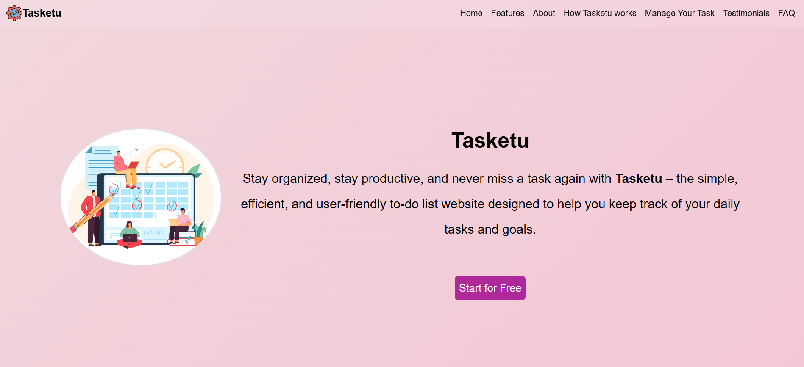

# Tasketu

Tasketu is a sleek and user-friendly task management website designed to help users stay organized and productive. With a clean UI and intuitive functionality, Tasketu allows users to add, edit, delete, and mark tasks as complete—all in a few clicks.

## ✔️  Demo Screenshot



## 🔗 Live Demo

Check out the app live here: **[Tasketu](https://premkrrajbhar.github.io/Tasketu/)**

## 📋 Features

- Add new tasks with ease  
- Edit existing tasks  
- Delete tasks you no longer need  
- Mark tasks as complete  
- Save tasks with persistent storage (localStorage)  
- Beautiful responsive layout with a modern gradient-based theme


## 🛠️ Technologies Used

- **HTML** Structure of the web page.
- **BootStrap** Styling for a modern UI.
- **CSS** for styling
- **JavaScript** Logic for managing tasks and local storage.
- **AOS library** for smooth animation when scrolling website.
- **Font Awesome** implements icons for various UI elements.
- **Random user generator** website for generating random profile pictures for the testimonial section.
- **Flaticon** provides icons used in the home section.


## 🚀 How to Use

- **Step 1:** Enter a new task in the input field.
- **Step 2:** Click 'Add' to save it to the list.
- **Step 3:** Click the 'Edit' icon to modify a task.
- **Step 4:** Click the 'Delete' icon to remove a task.
- **Step 5:** Click the check icon to mark a task as finished.

## 📂 Project Structure

```
├── LICENSE
├── README.md
├── assets
│   ├── favicon
│   │   └── tasketu-favicon.png
│   ├── images
│   │   ├── Testimonial-User
│   │   │   ├── user-1.jpg
│   │   │   ├── user-2.jpg
│   │   │   ├── user-3.jpg
│   │   │   ├── user-4.jpg
│   │   │   ├── user-5.jpg
│   │   │   ├── user-6.jpg
│   │   │   ├── user-7.jpg
│   │   │   └── user-8.jpg
│   │   └── img-1.jpg
│   ├── logo
│   │   └── tasketu-logo.png
│   ├── media
│   │   └── tasketu-tutorial.mp4
│   └── screenshot
│       └── screenshot.png
├── css
│   └── style.css
├── index.html
└── script
    └── script.js

```

## 📥 How to Run Locally

- Step 1: Clone the repository:

```bash
   git clone https://github.com/premkrrajbhar/Tasketu.git
```

- Step 2: Navigate to the project folder:

```bash
   cd Tasketu
```

- Step 3: Open the `index.html` file in your web browser to start using the app.


## 📝LICENSE

Tasketu is open-source software released under the MIT License. This means you are free to use, modify, and distribute the code as per the terms of the MIT license. See the [LICENSE](/LICENSE) file for more information.


## 🤝 Contributing

Contributions are welcome! If you have suggestions or improvements, feel free to submit a pull request or open an issue.

## 📞 Contact

For any questions or feedback, please reach out to:

- **Email**: [premkumar224487@gmail.com](mailto:premkumar224487@gmail.com)
- **GitHub**: [premkrrajbhar](https://github.com/premkrrajbhar)
